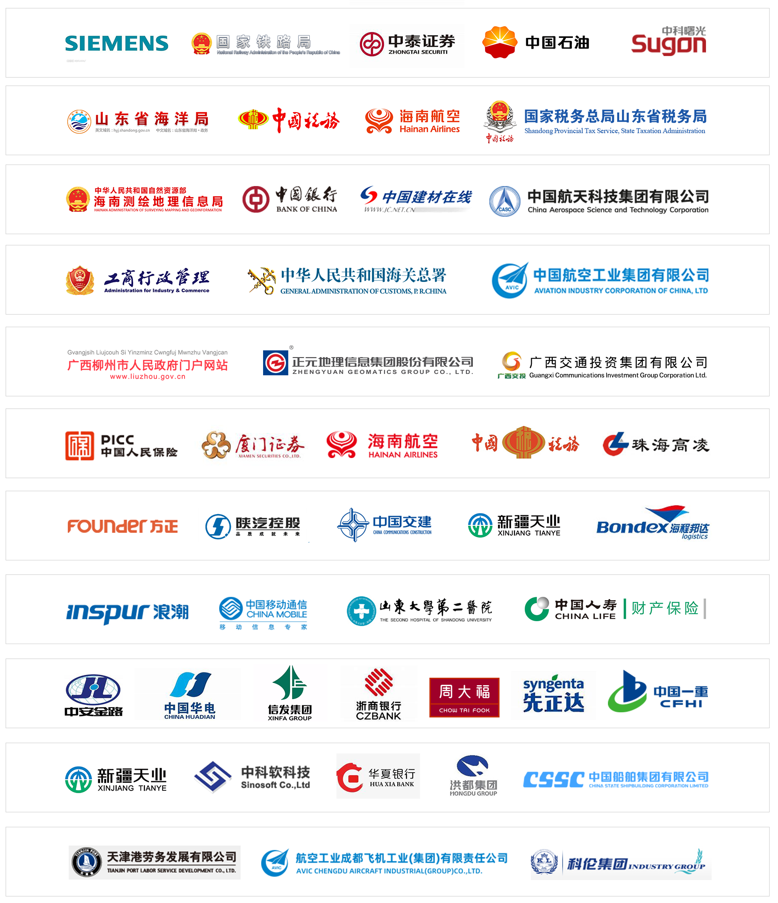
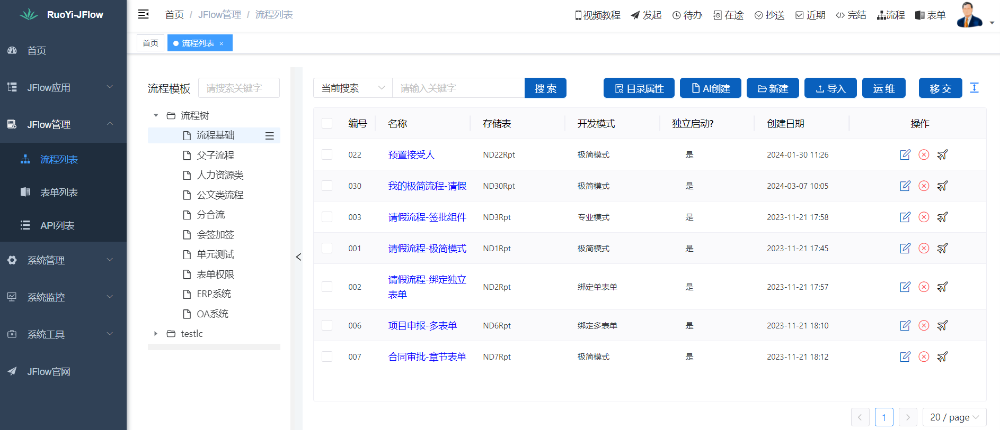
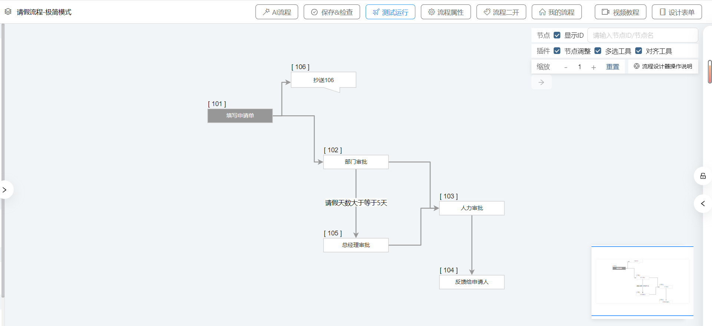
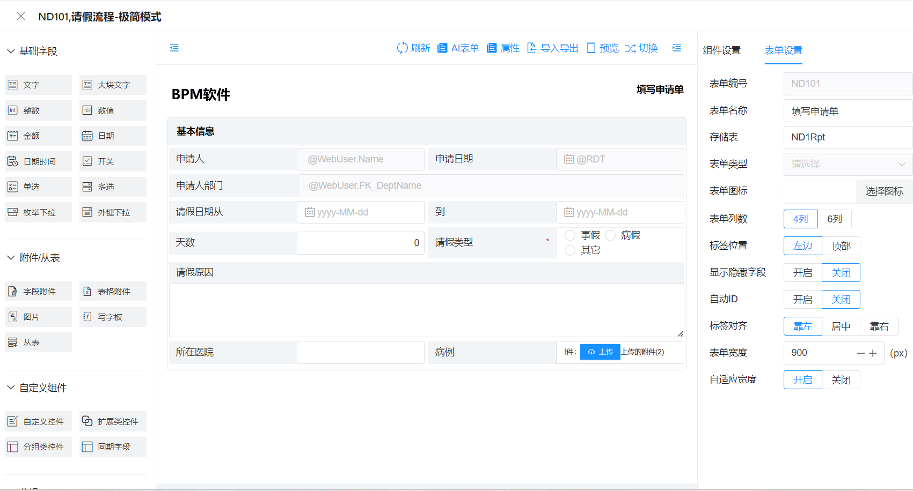
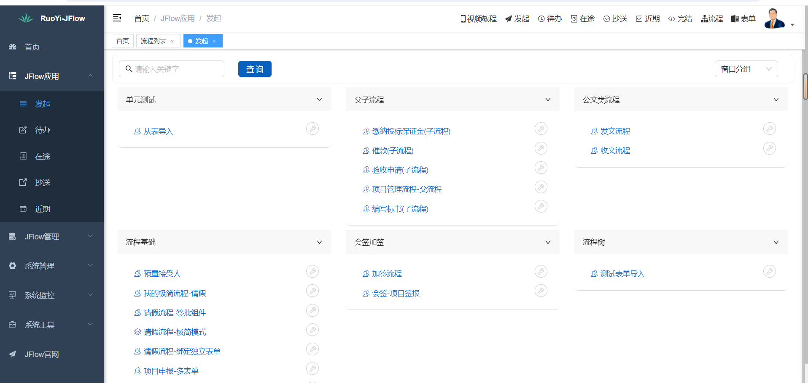
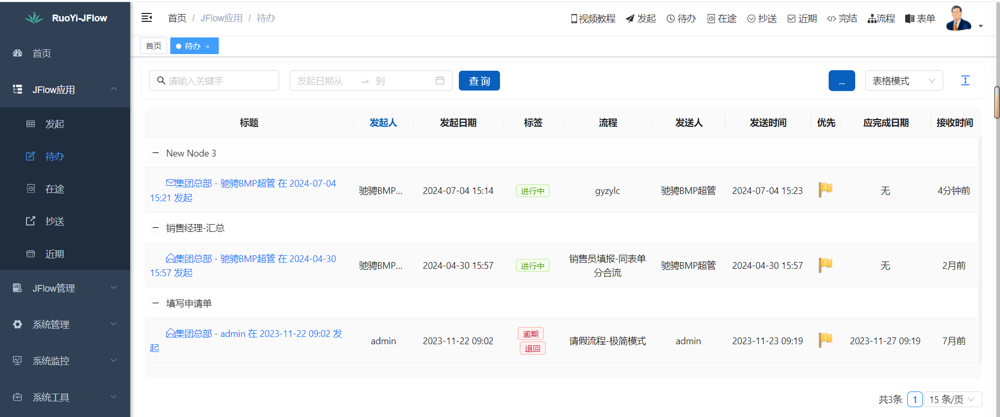
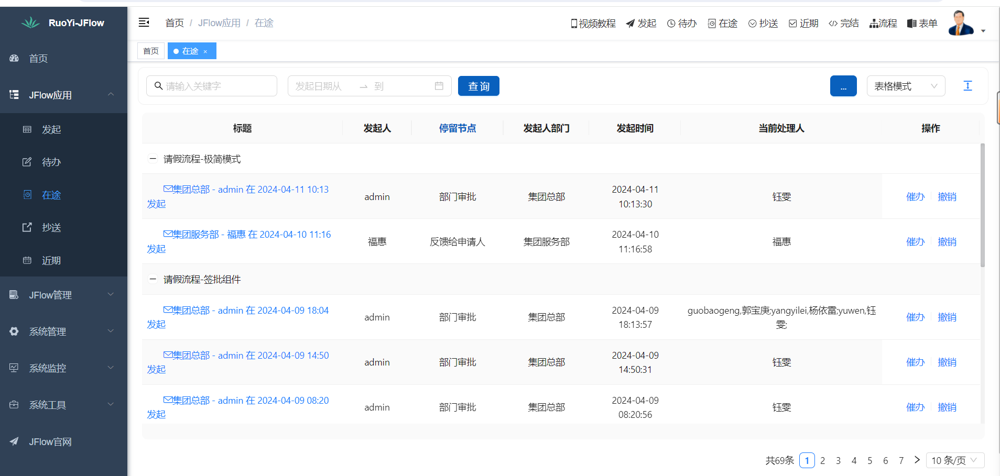
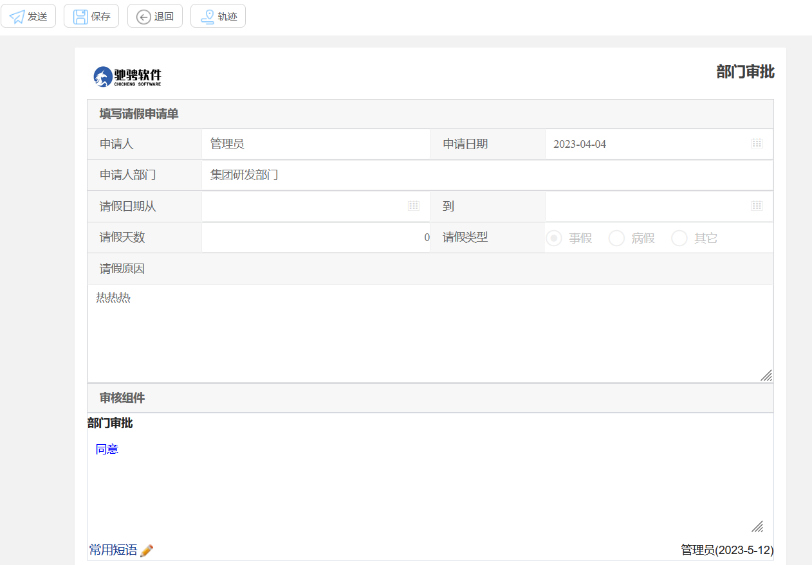

#### 演示地址
- http://ry.ccbpm.cn/
#### 如何安装？
- 启动文档:  https://gitee.com/opencc/RuoYi-JFlow/wikis/pages/preview?sort_id=9324287&doc_id=1983176
- 集成文档： https://docs.qq.com/doc/DT0JZRGFHUk5qc21q
- 技术文档:  http://doc.ccbpm.cn
- 视频教程1：https://pan.baidu.com/s/1J2lJSU-IK6KTgpdblKQnSw?pwd=m2x8
- 视频教程2：https://ccflow.org/Ke.html
- 技术交流QQ群: 728422467  , 注意点star加群.
#### JFlow简介
1. Ruoyi是一款开源的后台管理admin框架，JFlow是一款经典的纯国产全开源的工作流引擎，该版本是两者的完美结合。
1. 驰骋工作流引擎研发于2003年，具有.net与java两个版本，这两个版本代码结构、数据库结构、设计思想、功能组成、操作手册，完全相同。 导入导出的流程模版，表单模版两个版本完全通用。
1. 我们把驰骋工作流程引擎简称ccbpm，CCFlow是.net版本的简称，JFlow是java版本的简称。两款产品向社会100%开源。
1. 十多年来，我们一直践行自己的诺言，真心服务中国IT产业，努力提高产品质量，成为了国内知名的老牌工作流引擎。
1. 驰骋工作流引擎操作简单，概念通俗易懂，操作手册完善（计:14万字操作手册说明书），代码注释完整，案例丰富翔实，单元测试完整。
1. 驰骋工作流引擎包含表单引擎与流程引擎两大部分，并且两块完美结合，协同高效工作。
1. 流程与表单界面可视化的设计，可配置程度高，适应于中国国情下多种场景的需要。
1. 在国内拥有最广泛的研究群体与应用客户群，是大型集团企业IT部门、软件公司、研究院、高校研究与应用的产品。
1. 驰骋工作流引擎不仅仅能够满足中小企业的需要，也能满足通信级用户的应用，先后在西门子、海南航空、中船、陕汽重卡、华电国际、江苏测绘院、厦门证券、天业集团、天津港等国内外大型企业政府单位服役。
1. 驰骋工作流引擎方便与您的开发框架嵌入式集成，与第三方组织机构视图化集成, 既有配置类型的开发适用于业务人员，IT维护人员， 也有面向程序员的高级引擎API开发。
1. 支持oracle、sqlserver、mysql、pqsql,DM,UX,HanGao等数据库。
1. 流程引擎设计支持所见即所得的设计：节点设计、表单设计、单据设计、报表定义设计以及用户菜单设计。
1. 流程模式简洁，只有4种：线性流程、同表单分合流、异表单分合流、父子流程，容易理解，没有复杂的概念。
1. 配置参数丰富，支持流程的基础功能：前进、后退、转向、转发、撤销、抄送、挂起、草稿、任务池共享，支持高级功能：取回审批、项目组、外部用户等。
1. 加微信联系商务: 18660153393
#### 相关连接
- JFlow官网： https://ccflow.org 若依官网： http://ruoyi.vip
- JFlow(java): https://gitee.com/opencc/JFlow   CCFlow(.net): https://gitee.com/opencc/JFlow
#### Vue3版本
1. 代码位于\Vue3\*.*.
1. 数据库脚本位于\Vue3\sql\*.*
1. 安装步骤：https://gitee.com/opencc/JFlow-RuoYi/wikis/pages
1. 在线演示：https://ccflow.org/Demo.html
#### 部分案例

#### 系统截图.
- 提供的Vue3版本的系统截图, H5的样式风格请登录演示环境.
##### 后台设计
- 流程设计器
- 
- 
- 表单设计器
 
##### 前端执行
- 发起

- 待办

- 在途

- 工作处理

- 轨迹查看

- 时间轴

 
